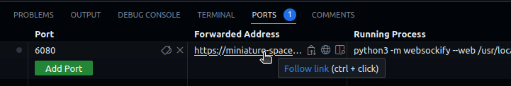

# ros4hri-tutorials

## Start the GitHub Codespaces

Start the Github Codespaces by clicking on `Code`, then `Codespaces`.

### Connect to the remote desktop



In the Codespaces' VSCode interface, click on the `PORTS` tab (next to
`TERMINAL`), and click on the *Forwarded Address* URL next to the `6080` port forward. Click on the
small globe icon to open a VNC connection to the remote desktop. The password is
`vscode`.

This desktop environment is connected to the Codespaces: any GUI application
that you start from the Codespaces' terminal (like `rviz`) will open in the remote desktop.


## Prepare the environment

### Initial environment preparation

Your environment (called a *devcontainer*) is based on [ROS
noetic](http://wiki.ros.org/noetic) with [some additional
tools](.devcontainer/Dockerfile). It is ready to use for our tutorial.

Let's simply create a basic ROS *workspace*, so that we can compile ROS nodes:

```
mkdir -p ws/src
cd ws
catkin init
catkin config --install
cd ..
```

## Playing ROS 'bags'

ROS bags are files containing ROS data (ROS *messages*) that have been
previously recorded. We can *play* ROS bag to re-create the datastream as they
were when they were recorded.

### Start ROS

In the same terminal, source your ROS environment:

```
source /opt/ros/noetic
```

> 💡 each time you open a new terminal, you first need to source your ROS
>  environment with this command.

Then, start `roscore`

```
roscore
```

### Download the bag files

I have prepared some bags for today's tutorial. Download them with `wget`:

First, open a new terminal by clicking on the `+` at the right of the terminal
panel.

> 💡 you can rename your terminals by right-clicking on them. For instance,
> name the first one `roscore` and the second one `bags`.

```
cd bags
wget https://skadge.org/data/severin-head.bag
wget https://skadge.org/data/severin-sitting-table.bag
cd ..
```

> 💡 if you are running this tutorial on your computer directly (ie, not in a
> devcontainer, you can use your webcam directly (instead of the bags file):
> 
> First install `usb_cam`: `apt install ros-noetic-usb-cam`
> Then, start it, **with the provided calibration file** (or your own, if you
> have a calibrated camera):
>
> ```
> rosrun usb_cam usb_cam_node _camera_info_url:="file:///`pwd`/default_webcam_calibration.yml"
> ```

### Display the content of the bag file


Source the ROS environment, and play the pre-recorded bag file:

```
source /opt/ros/noetic/setup.bash
rosbag play --loop bags/severin-head.bag
```

Type `rostopic list` to list the available ROS topic (ie, the ROS data
channels). You should see at least `/usb_cam/image_raw` that contains the raw
image pixels data.

Open yet another terminal, source ROS, and open `rqt_image_view`:

```
source /opt/ros/noetic/setup.bash
rqt_image_view
```

Switch to the remote desktop tab. You should see the RQT `image_view`
interface. Select the `/usb_cam/image_raw` topic in the drop-down list. It
should display the video stream.


We can alos visualize the bag file in `rviz`, the main ROS tool for data
visualization. Stop `rqt_image_view` (either close the window, or press Ctrl+C
in the terminal), and start `rviz` instead:

```
rviz
```

*Add* an `Image` plugin, and select the `/usb_cam/image_raw` topic like on the
screenshot below:


## Face detection

### Install hri_face_detect

We first want to detect faces in our test bag file.

We will use a ROS4HRI-compatible node for that purpose: [`hri_face_detect`](https://github.com/ros4hri/hri_face_detect/)

To install it:

First, let's get the code:

```
cd ws/src
git clone https://github.com/ros4hri/hri_face_detect.git
cd ..
```

Then, build it:

```
catkin build hri_face_detect
```

> 💡 all the dependencies are already included in your container, so the
> build step should work straight away. Otherwise, you would have had to install
> manually `mediapipe` (`pip3 install mediapipe`) and all the other ROS
> dependencies (`rosdep install -r -y --from-paths src`).

### Start the face detection node

The `hri_face_detect` node has been installed in the `install/` subfolder. We
need to tell ROS to look into that folder when starting a node. Type:

```
source ./install/setup.bash
```

Then, you can start the face detection node, remapping the default image topic
to the one actually published by the camera:

```
roslaunch hri_face_detect detect.launch rgb_camera:=usb_cam filtering_frame:=head_camera
```

You should immediately see on the console that some faces are indeed detected.
Let's visualise them.


#### Visualise the result

Open another terminal, and source ROS.

We can check that the faces are detected and published at ROS message by simply typing:

```
rostopic echo /humans/faces/tracked
```

We can also use `rviz` to display the faces with the facial landmarks. First,
install the `rviz` ROS4HRI plugin:

```
sudo apt install ros-noetic-hri-rviz
```

Then, start `rviz`, set the fixed frame to `head_camera`, and enable the `Humans` and TF plugins:


Configure the `Humans` plugin to use the `/usb_cam/image_raw` topic. You should see the
face being displayed, as well as its estimated 6D position:


We are effectively running the face detector in a Docker container, running in a virtual machine somewhere in a Github datacentre!

### Install hri_fullbody

Next, let's detect 3D skeletons in the image.

We will use the ROS4HRI-compatible [`hri_fullbody`](https://github.com/ros4hri/hri_fullbody/) node.

To install it:

First, let's get the code:

```
cd ws/src
git clone https://github.com/ros4hri/hri_fullbody.git
cd ..
```


Then, build it:

```
catkin build hri_fullbody
```

> 💡 again, all the dependencies are already installed. To do it manually: `pip3
> install mediapipe ikpy` followed by `rosdep install -r -y --from-paths src`.

### Start the body detection

First, go back to the terminal playing the bag file. Stop it (Ctrl+C), and start
the second bag file:

```
rosbag play --loop --clock severin-sitting-table.bag
```

Now, open a new terminal, and source `install/setup.bash` (this will also
automatically source `/opt/ros/noetic.setup.bash`):

```
cd ws
source install/setup.bash
```

Start the body detector:

```
roslaunch hri_fullbody hri_fullbody.launch rgb_camera:=usb_cam
```

Re-open the browser tab with `rviz`: you should now see the skeleton being
detected, in addition to the face:


## 'Assembling' full persons

Now that we have a face and a body, we can build a 'full' person.


Until now, we were running two ROS4HRI perception module: `hri_face_detect` and
`hri_fullbody`.

The face detector is assigning a unique identifier to each face that it
detects (and since it only *detects* faces, but does not *recognise* them, a
new identifier might get assigned to the same actual face if it disappears and
reappears later); the body detector is doing the same thing for bodies.

Next, we are going to run a node dedicated to managing full *persons*. Persons
are also assigned an identifier, but the person identifier is meant to be permanent.

First, to avoid generating too many new people, we are going to only publish the
few same frames from the video. Switch back to your `rosbag` terminal. Stop the
current bag (Ctrl+C), and run:

```
rosbag play --loop --clock -s 3 -u 1 severin-sitting-table.bag
```

Then, open a new terminal and install `hri_person_manager`:

```
cd ws/src
git clone https://github.com/ros4hri/hri_person_manager.git
cd ..
catkin build hri_person_manager
```

Source again `install/setup.bash`, configure some general parameters (needed
because we are using a webcam, not an actual robot, [check the doc](https://github.com/ros4hri/hri_person_manager?tab=readme-ov-file#hri_person_manager) to know more), and start
`hri_person_manager`:

```
source install/setup.bash
rosparam set /humans/reference_frame head_camera
rosparam set /humans/robot_reference_frame head_camera
rosrun hri_person_manager hri_person_manager
```

If the face and body detector are still running, you might see that
`hri_person_manager` is already creating some *anonymous* persons: the node
knows that some persons must exist (since faces and bodies are detected), but it
does not know *who* these persons are (you can ignore the warning regarding TF
frames: they come from the use of bag files instead of real 'live' data).

To get 'real' people, we need a node able to match for instance a *face* to a unique and
stable *person*: a face identification node.

### Display the person feature graph

We can use a small utility tool to display what the person manager understand of
the current situation.

Open a new terminal and run:

```
source /opt/ros/noetic/setup.bash
cd ws/src/hri_person_manager/scripts/
./show_humans_graph.py & evince /tmp/graph.pdf
```

You should see a graph similar to:


### Connecting the person feature graph

First, let's manually tell `hri_person_manager` that the face and body are
indeed parts of the same person. TO do so, we need to publish a *match* between
the two ids (in this example, `rlkas` (the face) and `mnavu` (the body), but
your IDs might be different, as they are randomly chosen)

In a new terminal (with ROS sourced):

```
rostopic pub /humans/candidate_matches hri_msgs/IdsMatch "{id1: 'rlkas', id1_type: 2, id2: 'mnavu', id2_type: 3, confidence: 0.9}"
```

The graph updates to:


> ⚠️  do not forget to change the face and body IDs to match the ones in your system!

> 💡 the values `2` and `3` correspond respectively to a face and a body. See
> [hri_msgs/IdsMatch](https://github.com/ros4hri/hri_msgs/blob/master/msg/IdsMatch.msg)
> for the list of constants.

### Manually identifying the person

To turn our *anonymous* person into a known person, we need to match the face ID
(or the body ID) to a person ID:

For instance:

```
rostopic pub /humans/candidate_matches hri_msgs/IdsMatch "{id1: 'rlkas', id1_type: 2, id2: 'severin', id2_type: 0, confidence: 0.9}"
```

The graph updates to:


Know that the person is 'known' (ie, at least one person 'part' is associated to
a person ID)m the automatically-generated 'anonymous' person is replaced by the
actual person.

We are doing it manually here, but in practice, we want to do it automatically.

### Installing and running automatic face identification

Let's install the `hri_face_identification` node:

```
cd ws/src
git clone https://github.com/ros4hri/hri_face_identification.git
cd ..
```


Then, build it:

```
catkin build hri_face_identification
```

> 💡 again, all the dependencies are already installed in the container. To do
> it manually, run `rosdep install -r -y --from-paths src`.


Start the node:

```
source install/setup.bash
roslaunch hri_face_identification face_identification.launch
```

You can now check in the graph (or directly on the `/humans/candidate_matches`
topic): the face should now be automatically associated to a person.

### Probabilistic feature matching

The algorithm used by `hri_person_manager` exploits the probabilities of *match*
between each and all personal features perceived by the robot to find the most
likely set of *partitions* of features into persons.

For instance, from the following graph, try to guess which are the most likely
'person' associations:


Response in the paper (along with the exact algorithm!): [the 'Mr Potato' paper](https://academia.skadge.org/publis/lemaignan2024probabilistic.pdf).

## If you want more...!

Here a few additional tasks you might want to try, to further explore ROS4HRI:

- Write a small Python script that list on the console the people around the
  robot ([hint!](https://www.phind.com/search?cache=rhu3n4zmjwshfp0h3vp29b9w)).

- write a node (C++ or Python) to automatically match faces and bodies. One
  approach consists in computing the overlap of the regions of interest of pairs
  of (face, body), and compute a likelihood based on that.

  Check the [`pyhri` API documentation](https://pyhri.readthedocs.io/en/latest/)
  here, and the [C++ `libhri` API
  documentation](http://docs.ros.org/en/noetic/api/hri/html/c++/) here.
