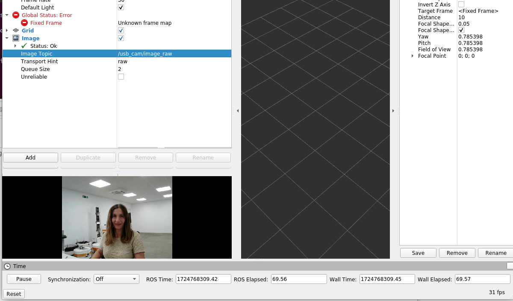
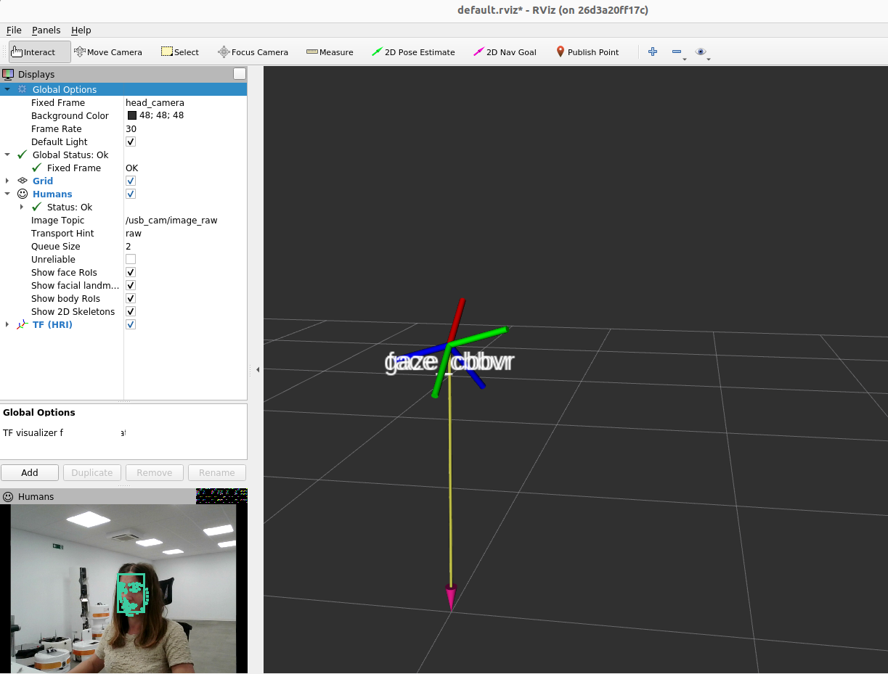

# ros4hri-tutorials

## Pull the ROS4HRI docker

Pull the docker that includes all dependencies and open-source ROS4HRI packages, built on top of ROS Noetic:

```
docker pull saracooper/ros4hri_noetic:v1
```

You can also choose to build the dockerfile on your laptop by cloning this repository, and 
building the docker on your machine. Note that if you want to use exclusive PAL packages these
are not built with this Dockerfile. 

```
git clone https://github.com/saracooper18/ros4hri-tutorials.git

docker build -t ros4hri_noetic .
```


### Run the docker

Firstly allow your docker containers to connect to your X server for display purposes:

```
xhost +local:docker
```

Start the docker with the following including graphics:

```
docker run --name ros4hri_noetic \
           --gpus all \
           -it --rm \
           --device=/dev/video0:/dev/video0 \
           --env="DISPLAY=$DISPLAY" \
           --env="QT_X11_NO_MITSHM=1" \
           --volume="/tmp/.X11-unix:/tmp/.X11-unix:rw" \
           --volume="$HOME/.Xauthority:/root/.Xauthority:rw" \
           --privileged \
           ros4hri_ros1
```

To access the same docker from a different terminal:

```
docker exec -it ros4hri_noetic bash
```

If you see the dockerfile, you will see it already clones all the relevant ROS4HRI
nodes such as hri_face_detect, hri_body_detect, hri_person_manager and hri_face_identification,
which we will cover in this tutorial. It also sources the ROS workspace already so 
you do not need to do this everytime you access it. 

To start ROS run the ROS master in one terminal:

```
roscore
```


### Test your laptop camera

For this tutorial you will need to have a working USB camera, which can be the one 
integrated on your laptop. 

Run the camera with the following command. Note: use the provided calibration file (or your own, if you have a calibrated camera):

```
rosrun usb_cam usb_cam_node _camera_info_url:="file:///root/ros4hri_ws/src/ros4hri-tutorials/default_webcam_calibration.yml"
```

Type `rostopic list` to list the available ROS topic (ie, the ROS data
channels). You should see at least `/usb_cam/image_raw` that contains the raw
image pixels data.

Open yet another terminal, source ROS, and open `rqt_image_view`:

```
source /opt/ros/noetic/setup.bash
rqt_image_view
```

Switch to the remote desktop tab. You should see the RQT `image_view`
interface. Select the `/usb_cam/image_raw` topic in the drop-down list. It
should display the video stream.


We can also visualize the image in `rviz`, the main ROS tool for data
visualization. Stop `rqt_image_view` (either close the window, or press Ctrl+C
in the terminal), and start `rviz` instead:

```
rviz
```

*Add* an `Image` plugin, and select the `/usb_cam/image_raw` topic like on the
screenshot below:




## Face detection

We will start by detecting our faces. For that we use a ROS4HRI-compatible node for that purpose: [`hri_face_detect`](https://github.com/ros4hri/hri_face_detect/). The Noetic version is already available inside the docker
at the directory ros4hri_ws/src/. 

To run the node, you will need to remap the default image topic to the one actually published by the camera:

```
roslaunch hri_face_detect detect.launch rgb_camera:=usb_cam filtering_frame:=head_camera
```

You should immediately see on the console that some faces are indeed detected.
Let's visualise them.


#### Visualise the result

Open another terminal, and source ROS.

We can check that the faces are detected and published at ROS message by simply typing:

```
rostopic echo /humans/faces/tracked
```

An example output would be this:

```
header: 
  seq: 26
  stamp: 
    secs: 1724765934
    nsecs: 783203377
  frame_id: "head_camera"
ids: 
  - qrnge
```

We can also use `rviz` to display the faces with the facial landmarks.
Then, in `rviz`, set the fixed frame to `head_camera`, and enable the `Humans` and TF plugins:


Configure the `Humans` plugin to use the `/usb_cam/image_raw` topic. You should see the
face being displayed, as well as its estimated 6D position:



We are effectively running the face detector in a Docker container!

### Body detection

Next, let's detect 3D skeletons in the image.

We will use the ROS4HRI-compatible [`hri_fullbody`](https://github.com/ros4hri/hri_fullbody/) node.

Open a new terminal, and start the body detector: 

```
roslaunch hri_fullbody hri_fullbody.launch rgb_camera:=usb_cam
```

Re-open the browser tab with `rviz`: you should now see the skeleton being
detected, in addition to the face:


## 'Assembling' full persons

Now that we have a face and a body, we can build a 'full' person.


Until now, we were running two ROS4HRI perception module: `hri_face_detect` and
`hri_fullbody`.

The face detector is assigning a unique identifier to each face that it
detects (and since it only *detects* faces, but does not *recognise* them, a
new identifier might get assigned to the same actual face if it disappears and
reappears later); the body detector is doing the same thing for bodies.

Next, we are going to run a node dedicated to managing full *persons*. Persons
are also assigned an identifier, but the person identifier is meant to be permanent.


Open a new terminal and configure some general parameters (needed
because we are using a webcam, not an actual robot, [check the doc](https://github.com/ros4hri/hri_person_manager?tab=readme-ov-file#hri_person_manager) to know more), and start
`hri_person_manager`:

```
rosparam set /humans/reference_frame head_camera
rosparam set /humans/robot_reference_frame head_camera
rosrun hri_person_manager hri_person_manager
```

If the face and body detector are still running, you might see that
`hri_person_manager` is already creating some *anonymous* persons: the node
knows that some persons must exist (since faces and bodies are detected), but it
does not know *who* these persons are.

To get 'real' people, we need a node able to match for instance a *face* to a unique and
stable *person*: a face identification node.

### Display the person feature graph

We can use a small utility tool to display what the person manager understand of
the current situation.

Open a new terminal and run:

```
cd root/ros4hri_ws/src/hri_person_manager/scripts/
./show_humans_graph.py
```

In a different terminal, but OUTSIDE your docker on a normal terminal, we will retrieve the file generated:

```
docker cp ros4hri_noetic:/tmp/graph.pdf .
```

Open it. You should see a graph similar to:


### Connecting the person feature graph

First, let's manually tell `hri_person_manager` that the face and body are
indeed parts of the same person. TO do so, we need to publish a *match* between
the two ids (in this example, `rlkas` (the face) and `mnavu` (the body), but
your IDs might be different, as they are randomly chosen)

In a new terminal inside the docker:

```
rostopic pub /humans/candidate_matches hri_msgs/IdsMatch "{id1: 'rlkas', id1_type: 2, id2: 'mnavu', id2_type: 3, confidence: 0.9}"
```

You can run the graph creator again, and pass it back outside the docker with the same command as before.

The graph updates to:


> ⚠️  do not forget to change the face and body IDs to match the ones in your system!

> 💡 the values `2` and `3` correspond respectively to a face and a body, while `1` corresponds to person. See
> [hri_msgs/IdsMatch](https://github.com/ros4hri/hri_msgs/blob/master/msg/IdsMatch.msg)
> for the list of constants.

### Manually identifying the person

To turn our *anonymous* person into a known person, we need to match the face ID
(or the body ID) to a person ID:

For instance:

```
rostopic pub /humans/candidate_matches hri_msgs/IdsMatch "{id1: 'rlkas', id1_type: 2, id2: 'severin', id2_type: 1, confidence: 0.9}"
```

The graph updates to:


Know that the person is 'known' (ie, at least one person 'part' is associated to
a person ID) when the automatically-generated 'anonymous' person is replaced by the
actual person.

We are doing it manually here, but in practice, we want to do it automatically.

### Running automatic face identification

In order to identify a specific person, we will use the [`hri_face_identification`](https://github.com/ros4hri/hri_face_identification) node. 

Start the node:

```
roslaunch hri_face_identification face_identification.launch
```

You can now check in the graph (or directly on the `/humans/candidate_matches`
topic): the face should now be automatically associated to a person.

```
id1: "chaeh"
id1_type: 1
id2: "rlkas"
id2_type: 2
confidence: 1.0
```

### Probabilistic feature matching

The algorithm used by `hri_person_manager` exploits the probabilities of *match*
between each and all personal features perceived by the robot to find the most
likely set of *partitions* of features into persons.

For instance, from the following graph, try to guess which are the most likely
'person' associations:


Response in the paper (along with the exact algorithm!): [the 'Mr Potato' paper](https://academia.skadge.org/publis/lemaignan2024probabilistic.pdf).


## Create a launcher that runs all together

Once you understand what each node does and how it works, you can run all the nodes together using the `ros4hri.launch` 
of this repository. 

```
<launch>
    <!-- Launch the USB camera node with a specific camera_info_url parameter -->
    <node name="usb_cam" pkg="usb_cam" type="usb_cam_node" output="screen">
        <param name="camera_info_url" value="file:///root/ros4hri_ws/src/ros4hri-tutorials/default_webcam_calibration.yml" />
    </node>

    <!-- Launch the hri_fullbody node with the RGB camera parameter -->
    <include file="$(find hri_fullbody)/launch/hri_fullbody.launch">
        <arg name="rgb_camera" value="usb_cam" />
    </include>

    <!-- Launch the face detection node with parameters for RGB camera and filtering frame -->
    <include file="$(find hri_face_detect)/launch/detect.launch">
        <arg name="rgb_camera" value="usb_cam" />
        <arg name="filtering_frame" value="head_camera" />
    </include>

    <!-- Launch the face identification node -->
    <include file="$(find hri_face_identification)/launch/face_identification.launch" />

    <!-- Set the parameters for the humans reference frame and robot reference frame -->
    <param name="/humans/reference_frame" value="head_camera" />
    <param name="/humans/robot_reference_frame" value="head_camera" />

    <!-- Launch the hri_person_manager node -->
    <node name="hri_person_manager" pkg="hri_person_manager" type="hri_person_manager" output="screen" />
</launch>
```

## Create new applications!

With the information given, you can start creating your own applications! 
For that have a look at the [`pyhri` API documentation](https://pyhri.readthedocs.io/en/latest/)
here, and the [C++ `libhri` API documentation](http://docs.ros.org/en/noetic/api/hri/html/c++/) here.
You can also have a look at the current standard messages of ROS4HRI 
[`hri_msgs`] (https://github.com/ros4hri/hri_msgs) that covers many more than those in this tutorial. 

Both are already installed in the docker. You have 2 example scripts already available in the example/ folder.
Feel free to add your own scripts on this repo so other people can see them!

**pyhri_person_listing.py**

Lists on the console the people around the robot. 

**engagement_expression.py**

Computes the engagement of the user firstly using the nodes covered in this tutorial.

It does this by using the visual social engagement metric that computes whether the person 
and the robot are looking at each others (mutual gaze), and divide the result by the 
distance (eg, you are considered to be engaged if you are looking at each other and sufficiently close.
The algorithm is described [here] (https://academia.skadge.org/publis/webb2022measuring.pdf)

As if you are using the laptop camera, the full body may not successfully detected, this example uses
only the face information. 

Engagement is published using the `/humans/persons/<id>/engagement_status` topic, a 
[hri_msgs/EngagementLevel](http://docs.ros.org/en/noetic/api/hri_msgs/html/msg/EngagementLevel.html) message. 

To test the example, first run the launcher that starts all the nodes:

```
cd /root/ros4hri_ws/src/ros4hri-tutorials/

roslaunch ros4hri.launch
```

Note you can also start the nodes separately, only the usb_cam and hri_face_detect.

Next on a different terminal, publish a static transform  between the webcam tf frame, 
and the sellion_link (frame simulating the eyes of the robot):

```
rosrun tf static_transform_publisher  0 0 0 -0.5 0.5 -0.5 0.5 sellion_link /head_camera 50
```

On another one, run the script from ros4hri-tutorials/examples:

```
python3 engagement_expression.py
```

As you get closer to the webcam and look at, you should be able to see through ROS that 
the engagement_status changes from 1 (DISENGAGED) to 3 (ENGAGED). 
For feasibility we will set a fixed person_id named "thsiisme":

```
rostopic echo /humans/people/thisisme/engagement_status

header:
  seq: 125
  stamp:
	secs: 0
	nsecs:     	0
  frame_id: ''
level: 1
---
header:
  seq: 126
  stamp:
	secs: 0
	nsecs:     	0
  frame_id: ''
level: 3
```

Now, to make the exercise more interactive, this example uses PAL Robotics TIAGo PRO
robot eyes. To run this eyes on your laptop, run:

roslaunch expressive_eyes expressive_eyes.launch 

Open a GUI to visualise the output:

```
rqt_image_view
```

And change to `/robot_face/image_raw/compressed`.

As you test your engagement, see how the robot is happy when you are engaged, and sad otherwise!


You can play with other expressions defined in [Expression.msg](https://github.com/ros4hri/hri_msgs/blob/master/msg/Expression.msg).
If you prefer you can change the eyes through the terminal by publishing directly to their ROS topic:

```
rostopic pub /robot_face/expression hri_msgs/Expression "header:
  seq: 0
  stamp: {secs: 0, nsecs: 0}
  frame_id: ''
expression: 'happy'
valence: 0.0
arousal: 0.0
confidence: 0.0" 
```


